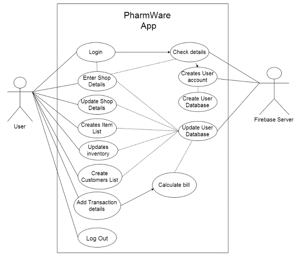
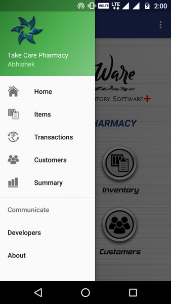
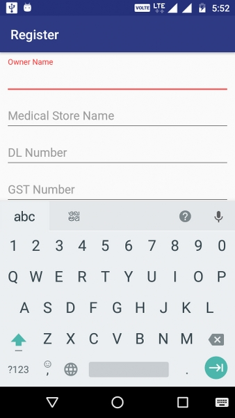
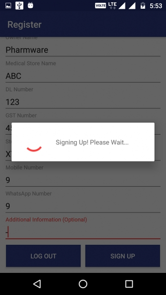
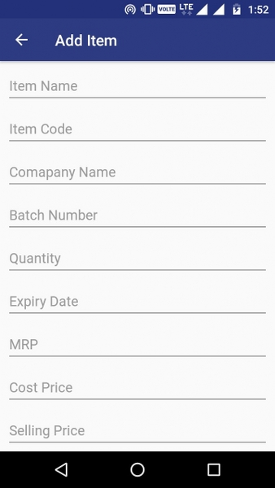
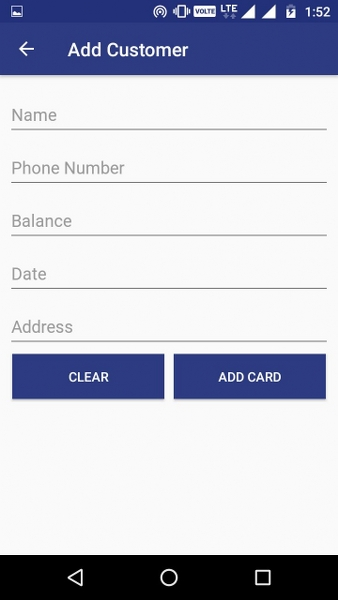
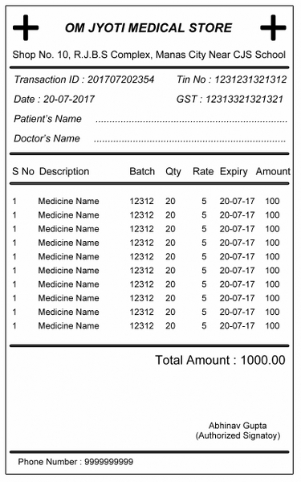
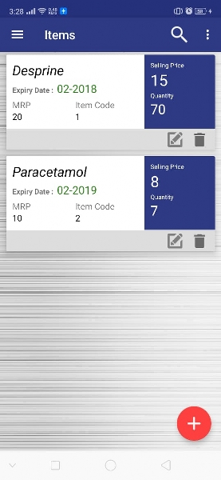

# Android Pharmacy Management System - Pharmware

## Introduction
Pharmware Android App is a Medical Inventory Application. 

Users of the app are only Medical store owner or any Pharmacy owner, using to store their sale and stock details. Before using the app Owner have to login with his/her valid Email-Id. It enables the Users to login with their google account as well. Users will be able to view the records of their regular customers. Records of the respective customer will be updated regularly.This software can also generate invoices for the transaction.


# Features :
* Google Authentication
*	Maintain List of Items in Inventory
*	Items also contain various relevant informations like 
    *	Selling Price, Cost Price, Discount, Count, Expiry Date etc.
*	Keep track of transactions and update stocks accordingly
*	Keep record of regular customers and suppliers , and also the money dues 
*	Lists can be viewed in various sorted manner
*	Notification about the items close to expiry or low in stock
*	All the data is backed up to server automatically
*	App can be used in offline mode also
*	Authentication using google sign in or email id verification
* Used **Google Firebase** for server requirement



## To Run App
1. Download ```APP-APK.apk``` [Download Link](https://raw.githubusercontent.com/ft-abhishekgupta/android-pharmacy-inventory-system-pharmware/master/APP-APK.apk "Direct Download")
1. Install on Android Device and run.

## To use source code : 
1. Clone Repository <br>
```git clone https://github.com/ft-abhishekgupta/android-pharmacy-inventory-system-pharmware```
1. Open Repository in Android Studio
1. Sync Project and Install Required Dependencies
1. Create project in Firebase, Upload SHA1 Fingerprint, Connect Project.
1. Build and Run Project.

## Screenshots










